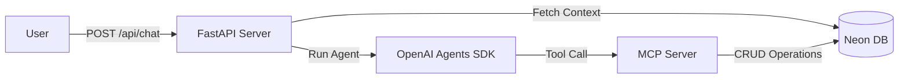

# Phase III: Todo AI Chatbot - Basic Level Functionality Specification

## Objective
Create an AI-powered chatbot interface for managing todos through natural language using MCP (Model Context Protocol) server architecture.

## Requirements
1.  **Conversational Interface**: Implement conversational interface for all Basic Level features.
2.  **AI Logic**: Use **OpenAI Agents SDK**.
3.  **MCP Server**: Build MCP server with **Official MCP SDK** that exposes task operations as tools.
4.  **Stateless Architecture**: Stateless chat endpoint that persists conversation state to database.
5.  **Data Persistence**: AI agents use MCP tools to manage tasks. MCP tools are stateless and store state in database.

## Technology Stack

| Component | Technology |
| :--- | :--- |
| **Frontend** | OpenAI ChatKit |
| **Backend** | Python FastAPI |
| **AI Framework** | OpenAI Agents SDK |
| **MCP Server** | Official MCP SDK |
| **ORM** | SQLModel |
| **Database** | Neon Serverless PostgreSQL |
| **Authentication** | Better Auth |

## Architecture Overview



Scale & Resilience:
*   Scalability: Any server instance can handle any request.
*   Resilience: Server restarts don't lose conversation state.
*   Horizontal Scaling: Load balancer can route to any backend.
*   Testability: Each request is independent and reproducible.

## Database Models

### **Task**
*   `user_id`: String
*   `id`: Integer (PK)
*   `title`: String
*   `description`: String
*   `completed`: Boolean
*   `created_at`: Datetime
*   `updated_at`: Datetime

### **Conversation**
*   `user_id`: String
*   `id`: Integer (PK)
*   `created_at`: Datetime
*   `updated_at`: Datetime

### **Message**
*   `user_id`: String
*   `id`: Integer (PK)
*   `conversation_id`: Integer (FK)
*   `role`: String (user/assistant)
*   `content`: String
*   `created_at`: Datetime

## Chat API Endpoint

**POST /api/{user_id}/chat**

**Request:**
```json
{
  "conversation_id": 123, // Optional
  "message": "Buy milk"
}
```

**Response:**
```json
{
  "conversation_id": 123,
  "response": "I've added 'Buy milk' to your list.",
  "tool_calls": [...]
}
```

## MCP Tools Specification

The MCP server must expose the following tools:

### **1. add_task**
*   **Purpose**: Create a new task.
*   **Parameters**: `user_id` (str), `title` (str), `description` (str, optional).
*   **Returns**: `{"task_id": 5, "status": "created", "title": "Buy groceries"}`.

### **2. list_tasks**
*   **Purpose**: Retrieve tasks from the list.
*   **Parameters**: `user_id` (str), `status` (str, optional: "all", "pending", "completed").
*   **Returns**: Array of task objects.

### **3. complete_task**
*   **Purpose**: Mark a task as complete.
*   **Parameters**: `user_id` (str), `task_id` (int).
*   **Returns**: `{"task_id": 3, "status": "completed", "title": "Call mom"}`.

### **4. delete_task**
*   **Purpose**: Remove a task.
*   **Parameters**: `user_id` (str), `task_id` (int).
*   **Returns**: `{"task_id": 2, "status": "deleted", "title": "Old task"}`.

### **5. update_task**
*   **Purpose**: Modify task title or description.
*   **Parameters**: `user_id` (str), `task_id` (int), `title` (str, optional), `description` (str, optional).
*   **Returns**: `{"task_id": 1, "status": "updated", "title": "New Title"}`.

## Agent Behavior Specification

| User Command | Action |
| :--- | :--- |
| "Add..." | Call `add_task` |
| "Show...", "List..." | Call `list_tasks` |
| "Done...", "Complete..." | Call `complete_task` |
| "Delete..." | Call `delete_task` (if specific), else `list_tasks` first |
| "Change...", "Update..." | Call `update_task` |

**Conversation Flow:**
1.  Receive user message.
2.  Fetch conversation history from DB.
3.  Build message array (History + New).
4.  Store user message in DB.
5.  Run Agent (OpenAI Agents SDK) with MCP tools.
6.  Agent invokes MCP tools.
7.  Store assistant response in DB.
8.  Return response.

## Environment Configuration
*   **API Key**: Groq API Key
*   **Base URL**: `https://api.groq.com/openai/v1`
*   **Model**: `openai/gpt-oss-120b`
